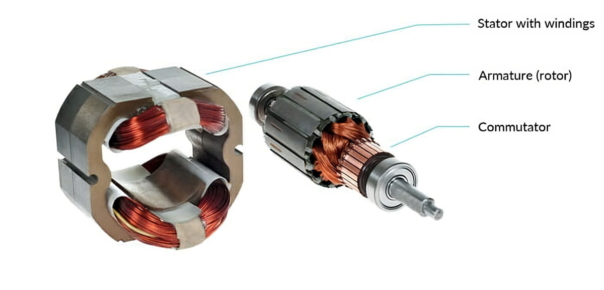

# Hardware Components

### Introduction

An **electrical motor** is a device that converts electrical energy into mechanical energy, typically through the interaction of magnetic fields and current-carrying conductors. It is widely used in various applications, from household appliances to industrial machinery and transportation.

#### Basic Principle

The working principle of most electrical motors is based on **electromagnetic induction**, which was discovered by Michael Faraday. When an electric current flows through a conductor placed in a magnetic field, a force is exerted on the conductor. This force, known as the **Lorentz force**, causes motion.

#### Main Components

1. **Stator**: The stationary part of the motor that generates a magnetic field. It usually consists of a coil of wire or permanent magnets.
2. **Rotor**: The rotating part of the motor placed within the stator's magnetic field. It experiences a torque due to the magnetic interaction and begins to rotate.
3. **Commutator (for DC motors)**: A mechanical switch that reverses the direction of current flow in the rotor coils to maintain continuous rotation.
4. **Shaft**: Connected to the rotor, it delivers the mechanical output to drive loads like fans, pumps, or wheels.

<figure><figcaption></figcaption></figure>
