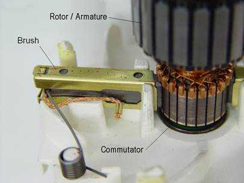

# Brushed DC Motors

### How Brushed Motors Work

A **brushed DC motor** operates using an internal component called a **commutator** (or brushes) that mechanically reverses the polarity of the motor's coils as they rotate past the fixed permanent magnets on the outer housing. The brushes remain in contact with the rotor to ensure continuous current flow to the coils, enabling the motor to spin.

To control a brushed motor, voltage is applied to the motor’s terminals. The speed of the motor is directly proportional to the voltage: the higher the applied voltage, the faster the motor will spin. The motor’s direction is controlled by reversing the polarity of the input voltage. For instance, if a positive voltage is applied to the (+) terminal and a negative voltage to the (-) terminal, the motor will spin **clockwise**. Reversing this (applying a negative voltage to the (+) terminal and a positive voltage to the (-) terminal) will cause the motor to spin **counterclockwise**.

This straightforward voltage control makes brushed motors simple to use, although they require more maintenance due to the wear of the brushes over time.

<figure><figcaption></figcaption></figure>

<figure><figcaption></figcaption></figure>

### FRC Approved Brushed Motors

* [AndyMark 9015 (am-0912)](https://www.andymark.com/products/banebots-550-motor?sku=am-3830)
* [AndyMark NeveRest (am-3104)](https://www.andymark.com/products/neverest-series-motor-only?Pinion%20and%20Connector=12%20Tooth%20w%2F%20Anderson%20Powerpole%20\(am-3104\)\&quantity=1)
* AndyMark PG (am-2161, am-2765, am-2194, am-2766)
* AndyMark RedLine Motor (am-3775, am-3775a)
* AndyMark Snow Blower Motor (am-2235, am-2235a)
* Banebots (am-3830, M7-RS775-18, RS775WC-8514, M5 – RS550-12, RS550VC-7527, RS550)
* CIM (FR801-001, M4-R0062-12, AM802-001A, 217-2000, PM25R-44F-1005, PM25R-45F-1004, PM25R-45F-1003, PMR25R-45F-1003, PMR25R-44F-1005, am-0255)
* KOP Automotive Motors (Denso AE235100-0160, Denso 5-163800-RC1, Denso 262100-3030, Denso 262100-3040, Bosch 6 004 RA3 194-06, Johnson Electric JE-PLG-149)
* Nidec Dynamo BLDC Motor (am-3740, DM3012-1063)
* Playing With Fusion Venom (BDC-10001)
* REV Robotics HD Hex motor (REV-41-1291)
* VEX BAG (217-3351)
* VEX Mini CIM (217-3371)
* West Coast Products RS775 Pro (217-4347)

