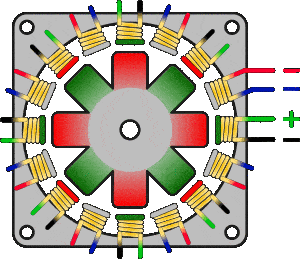

# Stepper Motor

A **stepper motor** is a type of DC motor designed to move in precise, discrete steps rather than continuously rotating like traditional motors. Each step corresponds to a fixed rotation angle, allowing for accurate control of position, speed, and direction without the need for feedback sensors. This makes stepper motors ideal for applications requiring precise movement, such as 3D printers, CNC machines, robotics, and camera positioning systems.

<figure><figcaption></figcaption></figure>

### How It Works

<figure><figcaption></figcaption></figure>

A stepper motor consists of:

* **Stator**: The stationary part with multiple coils (electromagnets) arranged in phases.
* **Rotor**: The rotating part, usually equipped with permanent magnets or soft iron.

When current is applied to the stator coils in a specific sequence, it generates a magnetic field that attracts the rotor, causing it to move in steps. By changing the sequence and polarity of the current to the coils, the rotor moves in small increments, or "steps." The number of steps per revolution (often between 200 to 400) determines the motor's resolution.

<figure><figcaption></figcaption></figure>

### Types of Stepper Motors

1. **Permanent Magnet Stepper Motor**: The rotor is made of permanent magnets, and it aligns with the stator's magnetic field. It offers good torque and efficiency.
2. **Variable Reluctance Stepper Motor**: The rotor is made of soft iron, which aligns with the magnetic field when a coil is energized. It’s less common and has lower torque compared to permanent magnet stepper motors.
3. **Hybrid Stepper Motor**: Combines features of both permanent magnet and variable reluctance types, providing higher torque and resolution.

### Key Features

* **Precise Control**: Each step represents a fixed angle of rotation, which allows for highly accurate positioning.
* **No Feedback Needed**: Stepper motors generally don’t require feedback systems like encoders since their movement is controlled by the input pulses.
* **Open-Loop Control**: Unlike servo motors, stepper motors typically operate in open-loop systems, meaning the controller sends signals without receiving position feedback, assuming the motor reaches the intended position.

### Advantages

* **High Precision**: Ideal for applications that need precise, repeatable movements.
* **Simple Control**: Easily controlled by sending electrical pulses in the correct sequence.
* **High Holding Torque**: Stepper motors can hold their position even when stationary, which is useful for locking mechanisms or maintaining a fixed position.

### Disadvantages

* **Less Efficient**: Stepper motors can consume more power, especially at high speeds.
* **Torque Drops at Higher Speeds**: As speed increases, the motor’s torque typically decreases.
* **Prone to Resonance**: Stepper motors can sometimes exhibit vibration or noise at certain speeds.

Overall, stepper motors are a popular choice when precise control of motion is required, particularly in open-loop systems where position feedback isn’t critical.

### FRC&#x20;

Stepper motors are generally **not allowed in FIRST Robotics Competition (FRC)** due to a combination of **power limitations**, **complexity**, and **safety concerns**, as well as the availability of more suitable alternatives like brushed and brushless DC motors
