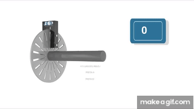
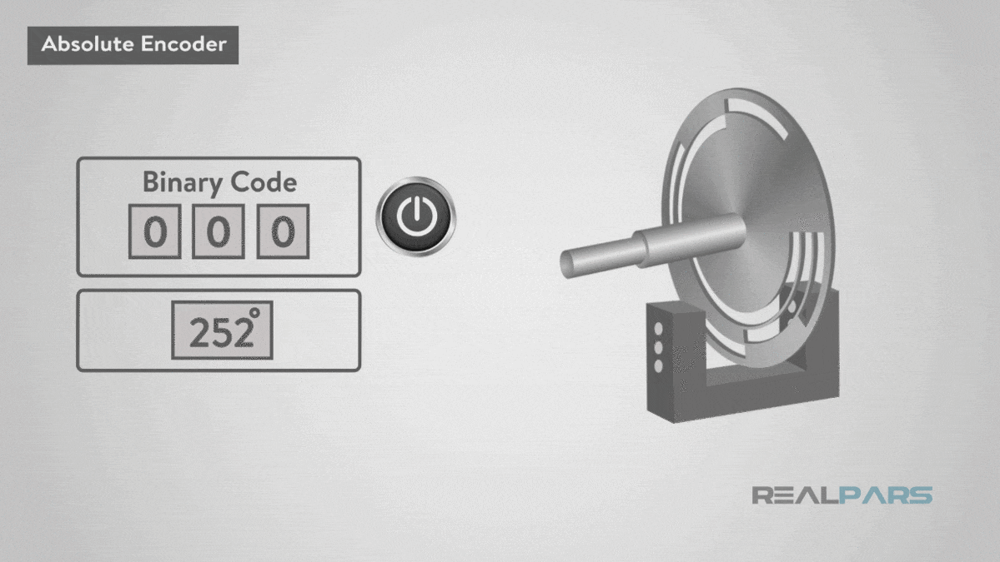

# Encoders

Encoders are essential components in motor control systems, providing feedback on the position, speed, and direction of a motor's rotation. There are several types of encoders used for motors, each with its unique characteristics and applications. Here are the main types:

### **Encoders**

Encoders measure the rotation of a shaft or axle. There are two types:

#### **Incremental Encoders**:&#x20;

<figure><figcaption></figcaption></figure>

Provide relative position information based on changes in position. They output a series of pulses as the shaft rotates, which can be counted to determine the position. They are often used in applications where the absolute position is not critical but speed and direction are important.

#### **Absolute/Liner Encoders**:&#x20;

<figure><figcaption></figcaption></figure>

Provide a unique position value for each position of the shaft. They can maintain position information even when power is lost. This makes them suitable for applications where knowing the exact position is critical, such as robotics and CNC machines.

There are several types such as magnetic, optical and capacitive encoders, based on the technique used in the detection&#x20;

<figure><figcaption></figcaption></figure>

### Encoders used in FRC&#x20;

In the **FIRST Robotics Competition (FRC)**, encoders are critical for providing feedback on motor speed, position, and direction, enabling precise control for various mechanisms like drive trains, arms, and manipulators. The encoders used in FRC can be grouped into several key types:

#### 1. **Quadrature Encoders (Incremental)**

Quadrature encoders are widely used in FRC for measuring both the rotational position and speed of motors. These encoders provide two output signals (A and B channels) that allow teams to track the direction of rotation and calculate the motor’s position relative to a starting point. They are commonly used for tasks such as tracking the distance traveled by wheels and controlling mechanisms like elevators.

* **Examples**:
  * **CTRE SRX Mag Encoder**: A magnetic quadrature encoder designed for FRC, often paired with the Talon SRX motor controller.
  * **AMT103-V Encoder**: A reliable quadrature encoder used in gearboxes for speed and position tracking.

#### 2. **Absolute Encoders**

Absolute encoders provide precise position feedback, even if the system loses power. Unlike incremental encoders, they give a unique position value for each angle of the motor’s rotation, making them perfect for applications where continuous knowledge of the motor's position is necessary. They are commonly used in mechanisms like arms or turrets, where accurate and persistent position tracking is critical.

* **Examples**:
  * **CTRE CANCoder**: A popular absolute encoder that communicates over the CAN bus, providing high-resolution position feedback.
  * **US Digital MA3 Encoder**: A magnetic absolute encoder frequently used in FRC for applications requiring continuous position tracking.

#### 3. **Integrated Motor Encoders (Incremental)**

Some motors used in FRC, such as the **NEO** and **Falcon 500**, come with built-in encoders, eliminating the need for external encoders. These integrated encoders provide highly accurate speed and position feedback directly from the motor, making them ideal for precise control in mechanisms like drive trains and manipulators.

* **Examples**:
  * **NEO and NEO 550 Motors**: Brushless motors with built-in encoders, popular for their high performance and ease of integration.
  * **Falcon 500 Motor**: Another brushless motor with an integrated encoder, commonly used in drive systems and high-precision mechanisms.

#### 4. **Built-in Gearbox Encoders**

Several gearboxes designed for FRC have built-in encoders or are compatible with encoder mounting options. These gearboxes simplify the encoder installation process and are commonly used in drive trains and other mechanical systems.

* **Examples**:
  * **AndyMark Toughbox Mini with Encoder**: A gearbox commonly used in FRC, with built-in compatibility for encoder installation.
  * **VEXPro VersaPlanetary Integrated Encoder**: Designed to attach directly to the VersaPlanetary gearbox, making it easy to add feedback to any mechanism using the gearbox.

#### 5. **Hall Effect Sensors**

Hall effect sensors are another feedback option, often used to detect the position of rotating parts like flywheels. They work by sensing changes in a magnetic field and are a good choice in environments where optical encoders might be affected by dirt or debris. While not as common as optical encoders, they are sometimes used for feedback in FRC mechanisms.

* **Example**:
  * **REV Robotics Through Bore Encoder**: A magnetic encoder that uses Hall effect sensors for robust rotational feedback.

#### 6. **Potentiometers**

While not true encoders, potentiometers are frequently used in FRC to provide analog position feedback. They are especially useful for mechanisms like arms and elevators, where the rotation is limited to less than 360 degrees. Potentiometers provide continuous position feedback, which is crucial for limiting the range of motion in certain mechanisms.

* **Example**:
  * **Bourns 10-turn Potentiometer**: A potentiometer used in FRC for precise position feedback in applications with limited rotational movement.

