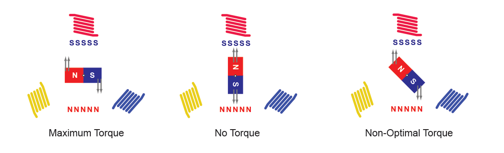

# Motor Control Theory

### Introduction

Motor control theories describe how motors are controlled and operated to achieve desired performance, ranging from simple open-loop control to advanced algorithms like Field-Oriented Control. These theories are essential in various applications, including robotics, electric vehicles, and industrial systems, where precision, efficiency, and adaptability are key. Here’s a detailed overview of the primary motor control methods:

Here is a table summarizing the motor control theories with key details on how they work, their advantages, disadvantages, and common applications:

This table organizes the key motor control theories with a clear overview of how each works, its pros and cons, and where it’s typically used.

| **Control Method**                                               | **How It Works**                                                                                                                 | **Advantages**                                                            | **Disadvantages**                                                             | **Applications**                                                         |
| ---------------------------------------------------------------- | -------------------------------------------------------------------------------------------------------------------------------- | ------------------------------------------------------------------------- | ----------------------------------------------------------------------------- | ------------------------------------------------------------------------ |
| <mark style="color:red;">**Open-Loop Control**</mark>            | Signal is sent to the motor without feedback; operates based solely on the input.                                                | Simple and cost-effective                                                 | No error correction, susceptible to load changes, friction, or other factors. | Basic fans, pumps, low-cost devices                                      |
| <mark style="color:red;">**Closed-Loop Control**</mark>          | Uses sensors to provide feedback on motor speed, position, or torque, and adjusts input accordingly.                             | More accurate, adaptable to varying loads and conditions.                 | More complex and costly compared to open-loop.                                | Robotics, industrial automation, precision drives                        |
| <mark style="color:red;">**PID Control**</mark>                  | Adjusts input based on the error between desired and actual performance using proportional, integral, and derivative components. | High accuracy, smooth performance, eliminates steady-state error.         | Requires careful tuning; can be difficult to set up for complex systems.      | Robotics, CNC machines, conveyor systems, precise control in FRC robots  |
| <mark style="color:red;">**Field-Oriented Control (FOC)**</mark> | Decouples control of torque and flux, transforming three-phase currents into a rotating two-axis reference frame.                | Maximizes torque, improves efficiency, smooth control even at low speeds. | Requires complex algorithms and more computational power.                     | Electric vehicles, drones, high-performance robotics, industrial drives  |
| **Direct Torque Control (DTC)**                                  | Directly controls motor torque and flux without transformations like in FOC; continuously adjusts voltage vectors.               | Fast response, high efficiency, better control at low speeds.             | Can produce some torque ripple, not as smooth as FOC.                         | High-performance industrial drives, electric vehicles                    |
| **Hysteresis Control**                                           | Maintains motor current within a specific range (hysteresis band) by switching input voltage on and off.                         | Simple and fast control of current levels.                                | Generates noise, less precise than PWM.                                       | Applications requiring strict current regulation, some motor drives      |
| <mark style="color:red;">**Pulse Width Modulation (PWM)**</mark> | Controls motor speed by switching input voltage on and off at high frequency; adjusts speed by varying the duty cycle.           | High efficiency, smooth control, reduces energy loss as heat.             | May produce electrical noise, risk of overheating at low speeds.              | FRC motor controllers, consumer electronics, electric vehicles, robotics |
| **Sensorless Control**                                           | Estimates motor speed and position using back EMF or electrical signals instead of physical sensors.                             | Reduces cost and complexity by eliminating sensors.                       | Less accurate at low speeds, depends on motor design.                         | Drones, e-bikes, low-cost motor-driven systems, hobbyist robotics        |

### What use in FRC

In the **FIRST Robotics Competition (FRC)**, several motor control techniques are commonly used, depending on the application and the precision required. The most prominent motor control methods employed in FRC include:

#### 1. **Closed-Loop Control**

FRC robots frequently use closed-loop control systems, where feedback from sensors like encoders or gyros is used to adjust the motor's speed or position. This is essential for tasks requiring precise control, such as moving arms, controlling drivetrain speed, or positioning mechanisms.

* **Applications in FRC**: Drivetrains, manipulators, lift mechanisms, and autonomous movement.

#### 2. **Proportional-Integral-Derivative (PID) Control**

PID control is highly popular in FRC, particularly for controlling speed, position, and other dynamic parameters. PID loops allow for smooth and accurate control by minimizing the error between the target and actual performance.

* **Applications in FRC**: Autonomous driving, arm positioning, turret control, and other precise movement tasks.

#### 3. **Pulse Width Modulation (PWM) Control**

PWM is widely used to control the speed of DC motors by varying the average voltage supplied to the motor. Most FRC motor controllers, such as the Talon SRX, Victor SPX, or Spark Max, use PWM to manage motor speeds smoothly.

* **Applications in FRC**: Speed control of motors for drivetrains, intake systems, and flywheels.

#### 4. **Field-Oriented Control (FOC)**

While not used as frequently as PID or PWM in basic systems, Field-Oriented Control is employed in advanced FRC designs, particularly for brushless motors like the Kraken and Falcon 500. These motors, which use FOC for efficient and smooth operation, are gaining popularity due to their high torque and efficiency.

* **Applications in FRC**: Drivetrains, shooting mechanisms (like flywheels), and any system using brushless motors.

#### 5. **Sensorless Control**

Sensorless control, which estimates motor position without physical sensors, is sometimes used with brushless motors in FRC. However, most FRC teams prefer to use feedback sensors like encoders for better accuracy.

* **Applications in FRC**: Brushless motor systems where simplicity and cost are important.

#### 6. **Open-Loop Control**

Open-loop control is occasionally used in FRC for simple systems where feedback isn’t critical. This approach is typically reserved for tasks where precision isn’t as important, such as controlling simple fans or basic systems with fixed movement.

* **Applications in FRC**: Simple mechanisms like conveyor belts or simple shooters.

#### Common FRC Motor Controllers:

* **Talon SRX** and **Victor SPX**: Support PWM and can be configured for closed-loop control with external sensors like encoders.
* **Spark MAX**: Designed for brushless NEO motors.
* **Falcon 500/Kraken x60**: An integrated brushless motor with a built-in controller that uses FOC.

Here’s a comparison table of motor control techniques commonly used in FRC, based on key factors like accuracy, response time, complexity, adaptability, and cost:

| **Control Method**                  | **Accuracy** | **Response Time** | **Complexity** | **Cost**         |
| ----------------------------------- | ------------ | ----------------- | -------------- | ---------------- |
| **1. Closed-Loop Control**          | High         | Moderate          | Moderate       | Moderate         |
| **2. PID Control**                  | Very High    | High              | High           | Moderate to High |
| **3. PWM Control**                  | Moderate     | Moderate          | Low            | Low              |
| **4. Field-Oriented Control (FOC)** | Very High    | Very High         | Very High      | High             |

### **Proportional-Integral-Derivative (PID) Control**

PID control (Proportional-Integral-Derivative control) is a fundamental control algorithm used to regulate the speed, position, or torque of electric motors, among many other applications. It’s widely used because it provides an efficient way to control systems by continuously adjusting its output to minimize errors between a desired target and the actual system response.

#### **High-Level Analogy: Controlling a Car's Speed**

Imagine you're driving a car, and your goal is to maintain a specific speed. However, external factors like wind resistance or changes in road slope can affect the car’s speed, requiring you to adjust the gas pedal.

* **Proportional control** is like pressing the gas pedal harder when you're farther from your target speed.
* **Integral control** is like remembering how long you’ve been off the target speed and compensating by pressing the gas pedal more firmly over time if you’ve been lagging for a while.
* **Derivative control** is like predicting how quickly the speed is changing, allowing you to ease off the pedal before you overshoot your target.

Now, let’s break down **PID control** in electric motors with more technical details, but we’ll still lean on this analogy for understanding.

***

#### **PID Control: The Basics**

In electric motors, PID control is used to regulate key parameters like:

1. **Speed** (e.g., keeping a motor running at 3000 RPM).
2. **Position** (e.g., moving a robotic arm to a specific angle).
3. **Torque** (e.g., maintaining a specific force on a load).

The PID controller works by calculating the **error**: the difference between the **desired value** (setpoint) and the **actual value** (what the motor is doing). Then it uses this error to compute how much to adjust the motor’s input (like voltage or current) to bring it closer to the desired target.

The output of the PID controller is the sum of three terms:

* The **Proportional (P)** term.
* The **Integral (I)** term.
* The **Derivative (D)** term.

#### **Step-by-Step Breakdown of PID Terms:**

**1. Proportional Control (P):**

This term is directly proportional to the current error. If the error is large, the control signal is large, which drives the motor harder to correct the error. It’s like pressing the gas pedal more when you notice you're farther from your desired speed.

* **Example**: Suppose the motor is running too slowly compared to the desired speed. The proportional term increases the voltage applied to the motor, causing it to accelerate.

Mathematically:

<figure><figcaption></figcaption></figure>

However, **P alone** isn't enough. If you only use proportional control, the system may not fully reach the target or it might overshoot, causing oscillations.

**2. Integral Control (I):**

The integral term deals with the **accumulated error** over time. This term looks at how long you’ve been away from the target. If the system has been off-target for a long time, the integral term builds up and increases the control signal to eliminate this persistent error.

In our driving analogy, if your car has been below the speed limit for a while, integral control is like pressing the gas more and more until the accumulated slowness is made up for.

* **Example**: If the motor is consistently running slightly below the target speed, the integral term will keep increasing the control signal until this long-term error is corrected.

Mathematically:

<figure><figcaption></figcaption></figure>

One potential problem with the integral term is **integral windup**. If the error accumulates for too long, the system can overshoot the target badly when the error finally corrects itself. Think of pressing the gas too hard for too long and then flying past the speed limit.

**3. Derivative Control (D):**

The derivative term predicts **how the error is changing** by calculating the rate of change of the error. If the error is decreasing quickly, it applies a brake to prevent overshooting. It’s like gently easing off the gas as you approach the speed limit, to avoid speeding past it.

* **Example**: If the motor is rapidly approaching the target speed, the derivative term will reduce the control signal to prevent the motor from overshooting the target.

Mathematically:

<figure><figcaption></figcaption></figure>

#### **The Complete PID Controller Equation:**

The final control signal that adjusts the motor's input is the sum of all three terms:

<figure><figcaption></figcaption></figure>

***

#### **How PID Control Works in Electric Motors**

In an electric motor, the PID controller continuously adjusts the voltage or current supplied to the motor to minimize the error between the desired and actual speed/position. Here’s how it applies:

1. **Proportional (P)** makes immediate adjustments based on the size of the current error. If the motor is too slow, it increases the voltage to make the motor spin faster.
2. **Integral (I)** deals with any sustained, long-term errors. If the motor is consistently off from the target speed by a small margin, the integral term compensates for this error over time.
3. **Derivative (D)** predicts future behavior by looking at the rate at which the motor’s speed is changing. If the motor is speeding up too quickly, it reduces the input to prevent overshooting.

This feedback loop operates in real-time, allowing the motor to follow the desired setpoint (speed, position, or torque) closely, despite any disturbances or changes in load.

***

#### **Tuning the PID Controller (Kp, Ki, Kd)**

The performance of a PID controller depends heavily on how the proportional, integral, and derivative gains are tuned. If the gains aren’t set properly, the motor may oscillate, respond too slowly, or overshoot the target.

<figure><figcaption></figcaption></figure>

* **High Kp​**: The system responds aggressively to error, but it may cause overshoot or oscillation.
* **High Ki​**: The system corrects long-term errors but can cause overshoot or instability due to integral windup.
* **High Kd​**: The system becomes more stable and resists overshooting but may respond too slowly to changes in the target.

In practice, tuning a PID controller for an electric motor is often done through trial and error or using systematic methods like **Ziegler-Nichols tuning**, which helps set the values of Kp, Ki, and Kd​ based on the system’s response.
