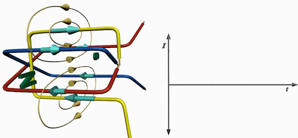

# Field Oriented Control (FOV)

**Field-Oriented Control (FOC)**, also known as **Vector Control**, is a sophisticated method used to control three-phase brushless motors, including **Brushless DC Motors (BLDC)** and **Permanent Magnet Synchronous Motors (PMSM)**. The purpose of FOC is to achieve precise and efficient control of torque and speed by controlling the motor's magnetic fields in a way that's more efficient and dynamic than traditional methods. FOC enables smooth and high-performance control of electric motors, even at low speeds, which is crucial in applications like electric vehicles, robotics, and industrial machinery.

To grasp how **FOC** works, we'll first go over the basic principles of three-phase motors and their magnetic fields, and then delve into how FOC manipulates those fields to control the motor efficiently.

### **High-Level Analogy: Controlling a Toy Boat in a Pool**

Imagine you're controlling a small toy boat in a pool. The boat moves by reacting to how you push it with a paddle. Ideally, you want to push the boat in the exact direction it needs to go, so you waste no energy paddling sideways or inefficiently. Now, imagine instead of directly paddling, you have control over invisible water currents beneath the boat (like the electric fields in the motor). By aligning the currents to push in exactly the right direction, you can move the boat (motor rotor) efficiently and precisely.

### **How a Three-Phase Brushless Motor Works**

In a **three-phase brushless motor**, the rotor (which moves) contains permanent magnets, and the stator (the stationary part) contains windings that create a rotating magnetic field when current flows through them. These motors run by interacting the rotor's permanent magnetic field with the electromagnetic field created by the stator.

1. **Three-Phase Currents**: Three windings in the stator are each powered by alternating currents (AC), which are 120 degrees out of phase with each other. This creates a rotating magnetic field that “drags” the rotor along with it.
2. **Rotor Magnetic Field**: The rotor, with its fixed magnets, tries to align itself with the rotating field created by the stator, causing it to spin.

Now, controlling this process efficiently requires keeping the rotor and the stator's magnetic fields in proper alignment. This is where **FOC** comes in.

<figure><figcaption></figcaption></figure>

If a magnet is placed on a rotor inside this cage, its North and South poles will be pulled towards the South and North poles of the rotating field. Assuming for a moment that the magnetic field rotation is paused, we can see the effect of the pull on the magnet at different angular positions relative to the rotating field.

<figure><figcaption></figcaption></figure>

We can see that the maximum torque is achieved when the rotor’s magnet is 90 apart from the stator field. If the rotor magnet is aligned with the stator field, the magnet experiences a very strong outwards pull which will burn power but create no torque or rotation at all. All other alignments will produce some amount of non-optimal torque. To make the motor turn optimally, we need therefore to know the angular position of the rotor in real time. Then apply voltage on the U V and W wires so that the magnetic field on the stator is 90 degrees apart. So going back to our example, if we measure the rotor to be at 90, we need to create the magnetic field in the stator at 180 degrees. The sine waves diagram shows that we must apply full negative voltage on U, and 50% voltage on V and W.

<figure><figcaption></figcaption></figure>

### **Summary of the FOC Process:**

1. **Measure the motor’s three-phase currents**.
2. **Transform** the currents into a simpler, 2D plane (Clarke transform).
3. **Transform** the 2D representation into a rotating reference frame aligned with the rotor (Park transform).
4. **Control the torque and field-alignment components** separately (using idi\_did​ for field and iqi\_qiq​ for torque).
5. **Transform back** from the rotating reference frame to the three-phase AC system (inverse Park and Clarke transforms).
6. Use **PWM** to apply the necessary voltages to the motor to achieve the desired control.

### **Why FOC is Powerful for Brushless Motors**

1. **Efficient Torque Control**: FOC allows precise control of torque and minimizes energy loss by aligning the rotor and stator fields efficiently.
2. **Smooth Operation**: Unlike simple control methods like six-step commutation, FOC produces smooth and continuous torque without torque ripple, even at low speeds.
3. **Wide Speed Range**: FOC provides excellent control across a wide range of speeds, making it perfect for applications where precise low-speed control is critical, such as electric vehicles or robotics.
4. **Optimal Performance**: Since you control the magnetic fields precisely, the motor operates near its maximum efficiency, improving battery life and reducing energy consumption.

### FOC in FRC&#x20;

### FOC Capable Kraken x60 

###  

By purchasing a license of Phoenix Pro, teams can unlock the added power and efficiency benefits of Field Oriented Control (FOC). FOC also allows for Torque control of the motor output which opens up additional motion control options.

CTR Phoenix 6 used to control the Kraken x60 motors

### Phoenix Pro Feature Breakdown

A full comparison of features between the free Phoenix 6 API and Phoenix Pro is shown below.

<figure><figcaption></figcaption></figure>

