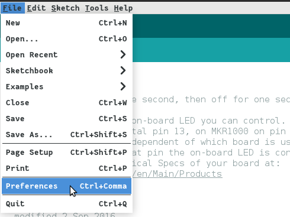

# Field Oriented Control (FOV)

First, FOC applies to three-phase Brushless Motors that are operating in sinusoidal mode. Sinusoidal commutation is more complex than trapezoidal commutation and is found in higher-end motor controllers.

<figure><figcaption></figcaption></figure>

In sinusoidal commutation, all three wires are permanently energized with a sinusoidal current 120 degrees apart on each phase. This has the effect of creating a North/South magnetic field that rotates inside the motor cage. As shown in the figure below

If a magnet is placed on a rotor inside this cage, its North and South poles will be pulled towards the South and North poles of the rotating field. Assuming for a moment that the magnetic field rotation is paused, we can see the effect of the pull on the magnet at different angular positions relative to the rotating field.

<figure><figcaption></figcaption></figure>

We can see that the maximum torque is achieved when the rotor’s magnet is 90o apart from the stator field. If the rotor magnet is aligned with the stator field, the magnet experiences a very strong outwards pull – which will burn power - but create no torque or rotation at all. All other alignments will produce some amount of non-optimal torque. In order to make the motor turn optimally, we need therefore to know the angular position of the rotor in real-time. Then apply voltage on the U V and W wires so that the magnetic field on the stator is 90 degrees apart. So going back to our example, if we measure the rotor to be at 90o, we need to create the magnetic field in the stator at 180 degrees. The sine waves diagram shows that we must apply full negative voltage on U, and 50% voltage on V and W.
